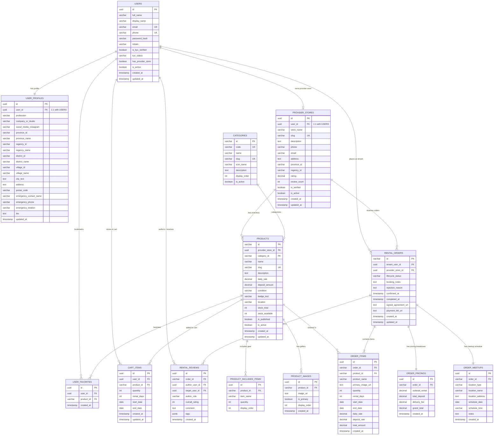

# 🚀 Arsitektur Database & Spesifikasi API Service (FE Front Office)
**Platform:** e-punyasewa — Platform Informasi & Reservasi Sewa Perlengkapan Modern  
**Versi API:** `v1` (`/api/v1/...`)  
**Format Amplop Respons:** Standard RESTful JSON Envelope

```json
{
  "status": "success" | "error",
  "message": "Pesan deskriptif dari server",
  "data": { ... } | [ ... ],
  "meta": {
    "timestamp": "ISO-8601",
    "pagination": {
      "currentPage": 1,
      "totalPages": 5,
      "totalItems": 50,
      "limit": 10
    }
  }
}
```

---

## 📊 1. ENTITY RELATIONSHIP DIAGRAM (ERD) & RELASI TABEL

Berikut adalah diagram relasi entitas database relasional (PostgreSQL) lengkap untuk backend e-punyasewa:



---

## 📑 2. DAFTAR LENGKAP ENDPOINT API (8 MODUL)

### MODUL 1: AUTENTIKASI & PROFIL PENGGUNA
* `POST /api/v1/auth/login` : Login kredensial (Email / WhatsApp & Password).
* `POST /api/v1/auth/register` : Registrasi akun penyewa baru.
* `GET /api/v1/user/profile` : Mengambil data diri, profesi, domisili, dan kontak darurat.
* `PUT /api/v1/user/profile` : Memperbarui data profil lengkap.

### MODUL 2: KATALOG & KATEGORI PRODUK
* `GET /api/v1/categories` : Daftar kategori unit sewa.
* `GET /api/v1/products` : Filter multi-parameter, search, dan pagination.
* `GET /api/v1/products/:idOrSlug` : Detail unit perlengkapan sewa.
* `GET /api/v1/provider-stores/:id` : Profil toko mitra penyedia.

### MODUL 3: RESERVASI & PESANAN PENYEWA
* `POST /api/v1/bookings` : Submit booking sewa unit baru.
* `GET /api/v1/orders/my-orders` : Riwayat booking penyewa (Filter status: `ALL`, `PENDING`, `ACTIVE`, `COMPLETED`, `REJECTED`).
* `POST /api/v1/orders/:id/extend` : Perpanjang durasi sewa (+N hari).
* `POST /api/v1/orders/:id/review` : Ulasan & rating penyewa untuk penyedia sewa.

### MODUL 4: PANEL MITRA PENYEDIA SEWA
* `GET /api/v1/provider/orders` : Timeline antrean pesanan masuk toko penyedia.
* `PUT /api/v1/provider/orders/:id/confirm` : Terima booking unit.
* `PUT /api/v1/provider/orders/:id/reject` : Tolak booking disertai alasan.
* `POST /api/v1/provider/orders/:id/upload-documents` : Upload berkas perjanjian TTD & kuitansi pelunasan (`multipart/form-data`).
* `PUT /api/v1/provider/orders/:id/complete` : Selesaikan sewa dan tutup transaksi.
* `POST /api/v1/provider/orders/:id/review-tenant` : Penyedia memberi review reputasi penyewa.

### MODUL 5: WILAYAH & DATA MASTER
* `GET /api/v1/regions/provinces` : Seluruh provinsi Indonesia.
* `GET /api/v1/regions/provinces/:id/regencies` : Kota/Kabupaten by ID Provinsi.
* `GET /api/v1/regions/regencies/:id/districts` : Kecamatan by ID Kota/Kab.
* `GET /api/v1/regions/districts/:id/villages` : Kelurahan by ID Kecamatan.
* `GET /api/v1/faqs` : Daftar tanya jawab resmi.

### MODUL 6: MEDIA & FILE STORAGE
* `POST /api/v1/storage/upload` : Upload berkas PDF / Gambar fisik ke server.

### MODUL 7: KERANJANG SEWA PENGGUNA (DATABASE CART)
* `GET /api/v1/cart` : Mengambil daftar item keranjang sewa milik user yang sedang login.
* `POST /api/v1/cart/items` : Menambahkan item sewa ke keranjang (`{ productId, quantity, startDate, endDate }`).
* `PUT /api/v1/cart/items/:id` : Mengubah jumlah unit (`quantity`) atau rentang tanggal sewa.
* `DELETE /api/v1/cart/items/:id` : Menghapus 1 item dari keranjang sewa.
* `DELETE /api/v1/cart` : Mengosongkan seluruh keranjang sewa user.

### MODUL 8: PRODUK FAVORIT (DATABASE WISHLIST)
* `GET /api/v1/favorites` : Mengambil seluruh unit favorit milik user yang login.
* `POST /api/v1/favorites/toggle` : Menambah / menghapus produk dari favorit (Toggle Status).
* `DELETE /api/v1/favorites/:productId` : Menghapus unit dari daftar favorit.
